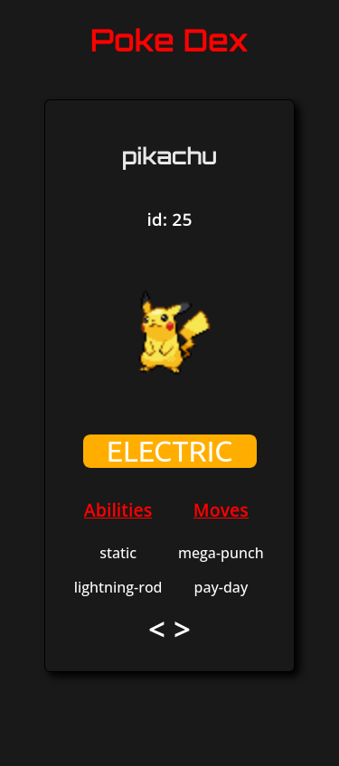
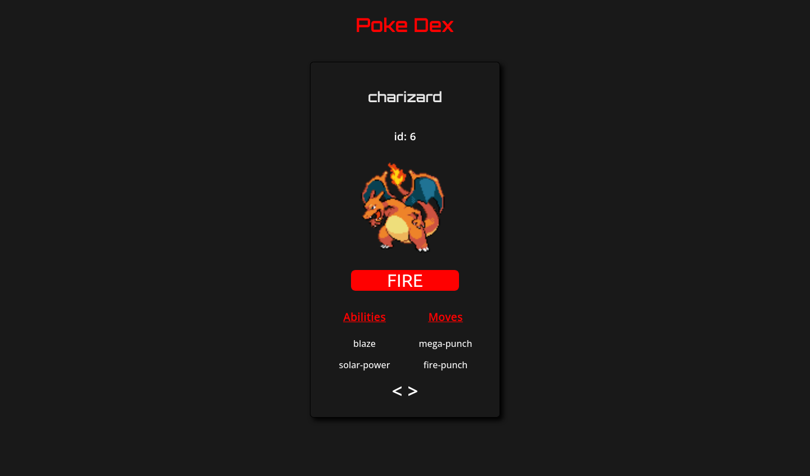

# PokeDex 

## Table of contents

  - [Overview](#overview)
  - [The challenge](#the-challenge)
  - [Screenshots](#screenshots)
  - [Links](#links)
  - [Built with](#built-with)
  - [What I learned](#what-i-learned)
  - [Author](#author)

## Overview
I created this project in order to practice my knowledge in HTML, CSS and Javascript

### The challenge

Users should be able to:

- View the optimal layout for the app depending on their device's screen size.
- See Pokemon's information based on their id.

### Screenshots

## Mobile

## Desktop

### Links

- Live Site URL: (https://dapper-truffle-16da66.netlify.app/)

### Built with

-  HTML5 markup
- CSS custom properties
- CSS Grid
- Javascript
- Mobile-first workflow

### What I learned

I learned how to get a response from an api, store it in a json object and render it on my webapp using DOM manipulation.

### Author

- Website - [Fernando Alves](https://www.linkedin.com/in/fernando-de-paula-alves-889110a5/)
- Twitter - [@fernandu00](https://www.twitter.com/fernandu00)

